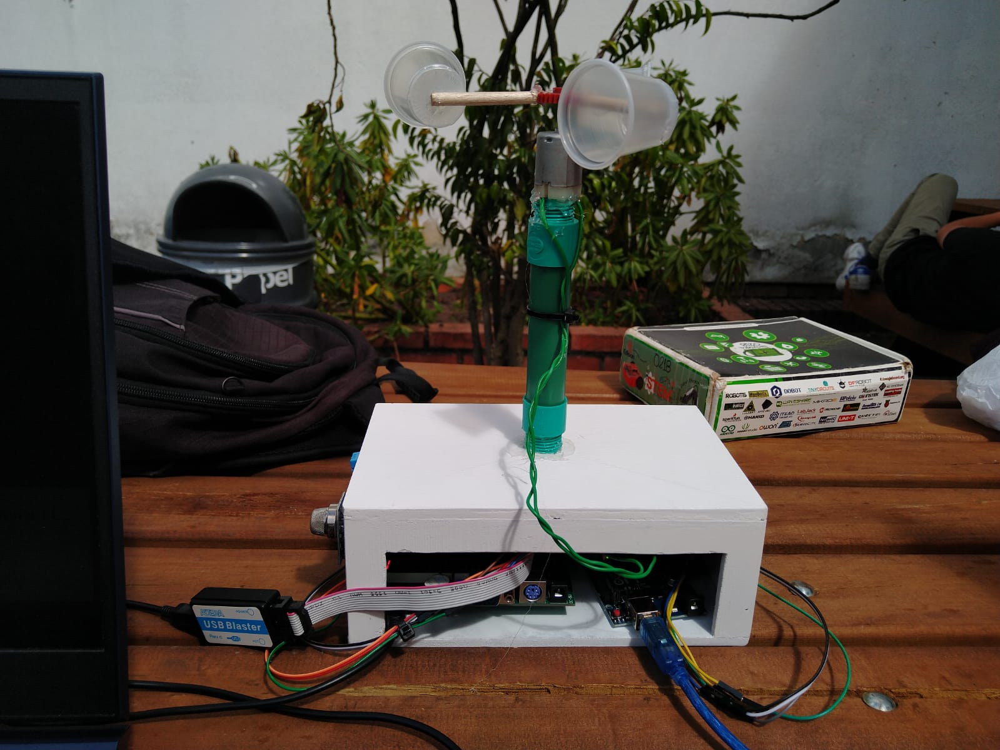
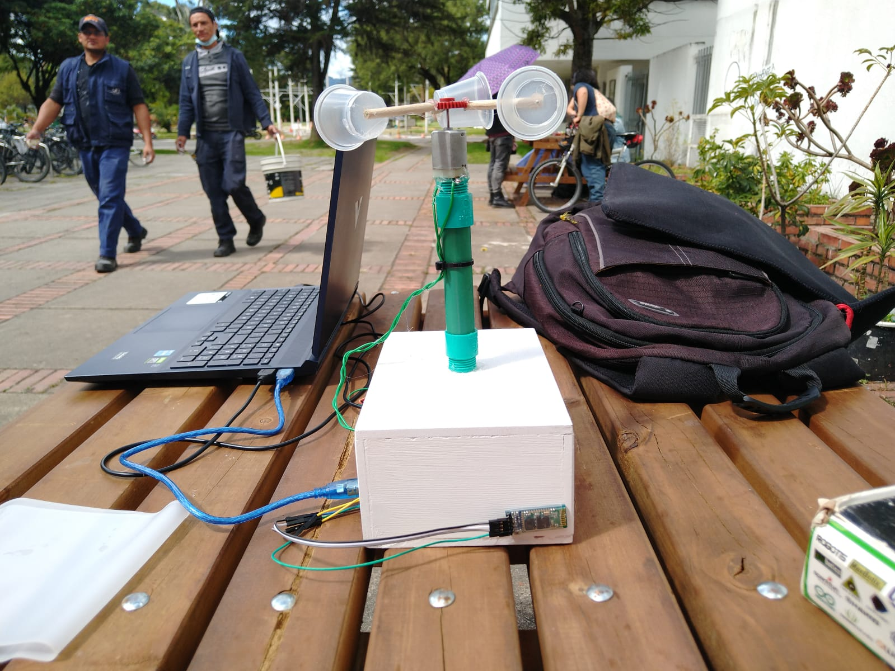
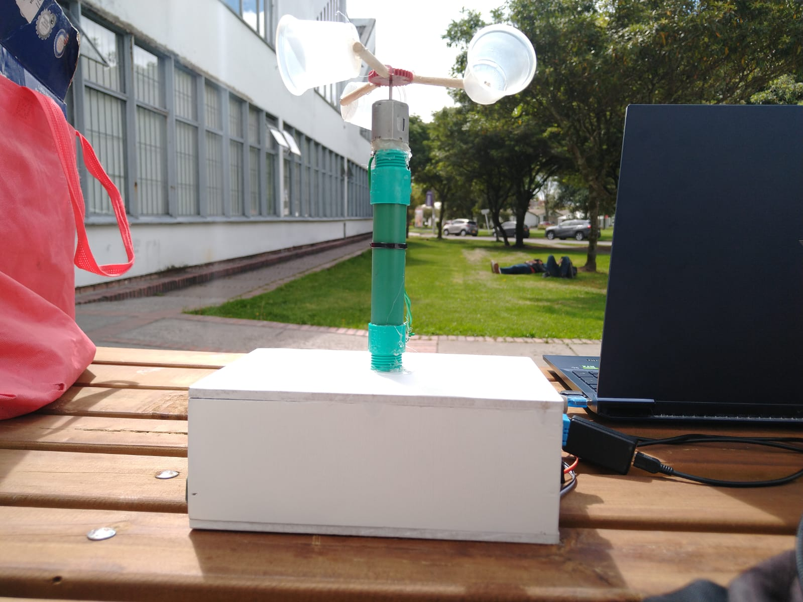
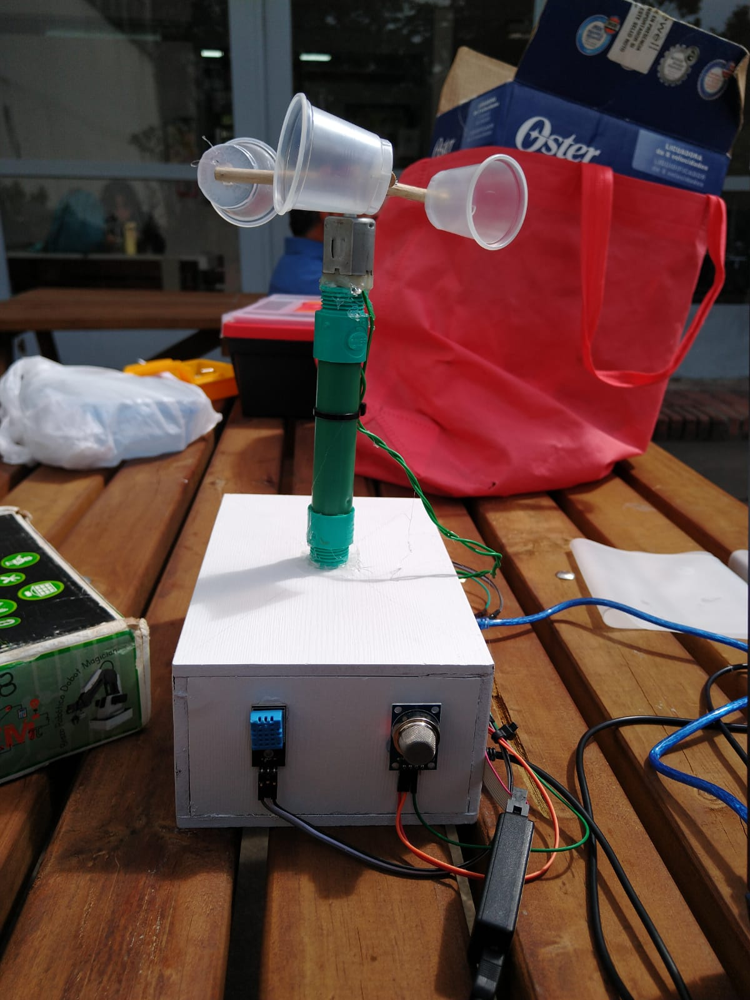
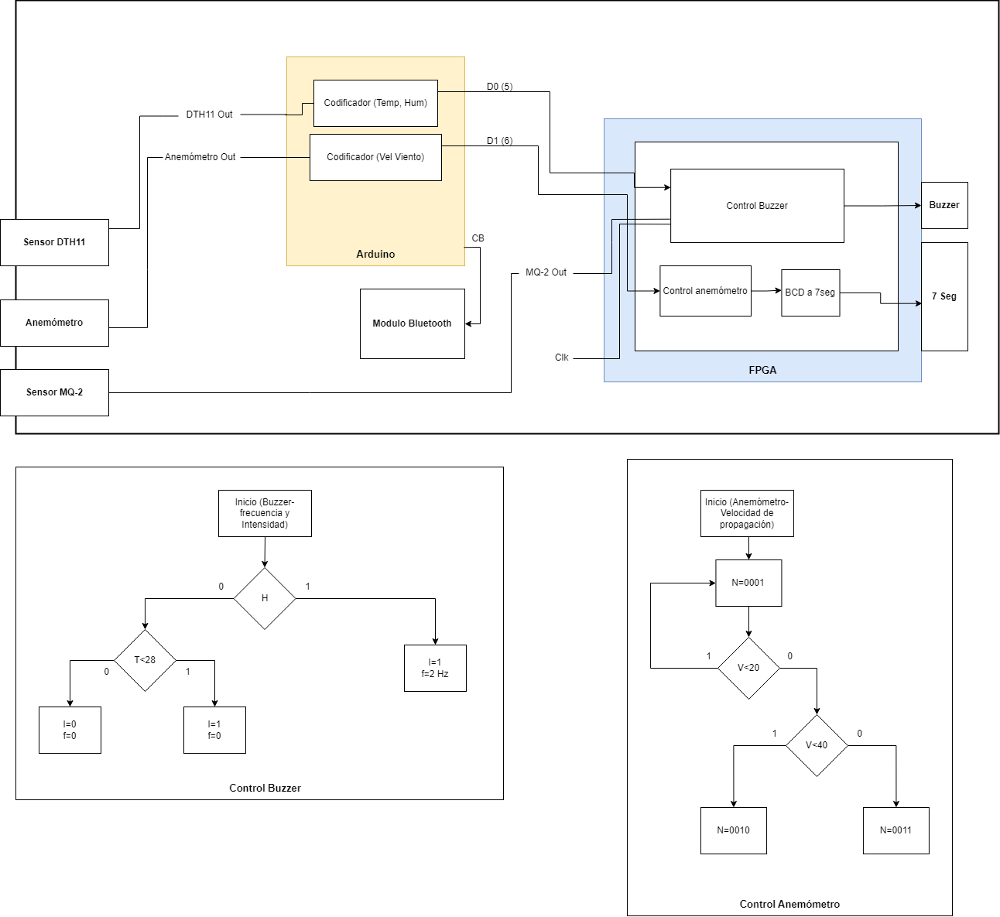
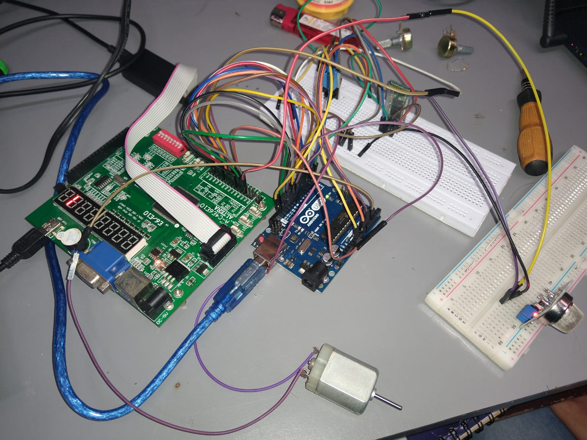

# Green-Guardian
Repositorio dedicado al proyecto final de Electronica Digital 1 (2022) 

## Tabla de contenidos

- [Inicio](#inicio)
- [Descripción](#descripción)
- [Perifericos](#perifericos)
- [Problematica](#problematica)
- [Antecedentes](#antecedentes)
- [Objetivos](#objetivos)
- [Diagramas de bloques y de flujo](#diagramas)
- [Evidencia de la implementación](#evidencia)
- [Referencias](#referencias)

# Inicio
## Integrantes 
- Andres Felipe Quijano Montenegro
- Julian Leonardo Robles Cabanzo
## Imagen del proyecto

# Descripción
Contenido de la sección "Descripción".

## Parametros de funcionamiento
### Rangos de temperatura (AUMENTO CON RESPECTO A LA INTENSIDAD):

| TEMPERATURA (°C) | INTENSIDAD |
| --- | --- |
| Menor a 28 | 0 |
| Mayor e igual a 28 | 1 |

### Rangos de presencia de humo (AUMENTO CON RESPECTO A LA FRECUENCIA):

| PRESENCIA DE HUMO | Frecuencia |
| --- | --- |
| SÍ | 2 Hz |
| No | 0 |

********************EN EL DISPLAY 7 SEGMENTOS SE MUESTRA EL NIVEL DE PROPAGACION DEL INCENDIO.********************

# Perifericos

## Perifericos de entrada
1. Sensor de temperatura: Es necesario implementar un sensor que pueda determinar si la temperatura en el bosque esta aumentando debido a un incendio.
2. Sensor de humedad: Verificar la humedad relativa del bosque, ya que, de ser alta hay menos probabilidad de ingnición en el bosque.
3. Sensor de humo : Para confirmar el caso de incendio y la quema de materia, el sensor de gas (humo) permite saber si hay y que tipo de gases hay.
4. Sensor de viento (anemómetro casero)

## Perifericos de salida
1. Bombilla : Alertar con precision el area en la cual esta sucediendo la emergencia, la idea es ubicarla en una sitio con la mejor visibilidad.
2. Parlante : Emite sonidos dependiendo del tipo y estado de emergencia.
3. Modulo de conectividad : Puede ser un modulo Wifi o Bluetooth, para permitir la interacion a una aplicación muy sencilla a un dispositivo cercano.

## Modelos
1. Sensor de temperatura/humedad: Sensor DTH11 (0° - 50°).
2. Sensor de humo: MQ-2 (GLP, propano, metano, alcohol, hidrógeno, humo).
3. Anemómetro: Casero (https://www.youtube.com/watch?v=02e59n0ZmRE).
4. Bombilla: Bombillo Incandescente de 100 W.
5. Parlante: Buzzer de la FPGA
6. Módulo de conectividad: Módulo Bluetooth para Arduino.
7. Aplicación (AppInventor2).

# Problematica
Alrededor del mundo, los incendios forestales son la causa primordial de la destrucción masiva de importantes bosques, además, de comprometer vida silvestre, bienes materiales e incluso vidas humanas que habitan en los lugares aledaños. El origen de esta catástrofe se remite a la propagación directa e indirecta de una llama que crece sin control a través de la zona urbana, poniendo en riesgo el ecosistema. 
##Datos respecto al problema
Los incendios forestales se pueden tratar en un panorama general, poniendo como escala a todo el mundo, pero pasando a Colombia, en base a estudio realizado por la Institución Universitaria Tecnológica de Antioquia, “Colombia cuenta con muy poca legislación que apoye la prevención de incendios forestales y la restauración ambiental”. Esto deja un precedente bastante preocupante, ya que, es un problema que se lleva arrastrando desde antes de 2013 cuando fue escrito dicho estudio. 
Adicionalmente, dichos incendios forestales, afectan bastante al suelo del ecosistema, teniendo como principales afectados al pH, los nutrientes iniciales y sus actividades biológicas, entre otras cosas, mostrando que la preocupación va más allá de la poca legislación, llegando hasta una cuestión de una afectación directa hacía el panorama venidero de producción del país. [1]

## Analisis PESTAL
+ **Político:** Se evidencian pocos mecanismos propuestos por parte del estado para disminuir la afectación producida por los incendios forestales que tanto azotan al país, ya que, durante solo en el mes de enero de 2023 se reportaron 437 incendios forestales en promedio por día en Colombia, según cifras reportadas por la Universidad Externado de Colombia, mostrando que no es un problema que sea de poca escala como para no ser tenido en cuenta. [2]
+ **Económico:** Con los incendios forestales se genera un aumento directo al gasto público para contenerlos, sin mencionar el daño al hogar de diversas comunidades étnicas que también entra en el panorama general económico del país para intentar solventar dicho inconveniente.
+ **Social:** Según el Instituto Distrital de Gestión de Riesgos y Cambio Climático (IDIGER), “la presencia de incendios forestales en áreas próximas a asentamientos humanos puede causar la afectación de viviendas, maquinaria, infraestructura y equipos”,  todo esto además del deterioro de la calidad de vida de las personas que habitan los lugares próximos a los incendios en base a las emisiones durante la combustión. [3]
+ **Tecnólogico:** En las zonas aledañas a los incendios forestales, se evidencia -en ocasiones- pérdida de equipos de origen tecnológico y comunicaciones, todo esto debido a la propagación caótica de los mismos.
+ **Ambiental:** Referenciando el inicio del presente documento, los incendios forestales afectan la funcionalidad del sistema ambiental de manera ingente, como lo son el agua, el aire, la flora, la fauna y el suelo, lo que a posteriori afecta la calidad de bienes y servicios que se proveen a todo el país, incluyendo a Bogotá, como la calidad del aire.
+ **Legal:** En Colombia existen distintas disposiciones e instrumentos jurídicos que hacen referencia a los incendios forestales, como lo son: los artículos del 241 al 245 del Código Nacional de Recursos Naturales Renovables y de Protección al Medio Ambiente (Decreto Ley 2811 de 1974), la Ley 37 de 1989, el Decreto 4296 de 2004, el artículo 30 del Decreto 948 de 1995, el incendio de bosques como agravante del tipo penal del incendio (artículo 350 de la Ley 599 de 2000), el Plan Nacional de Prevención, Control de Incendios Forestales y Restauración de Áreas Afectadas, entre otros.

# Antecedentes
Actualmente existen varios programas o proyectos desarrollados con el fin de detectar y combatir incendios forestales:
+ **Fire Maps:** Programa de monitorización de la NASA mediante satélites que proporciona datos sobre incendios casi en tiempo real.
+ **Ofidia 2:** Proyecto europeo enfocado en prevenir el peligro de incendio, capaz de predecir el riesgo de incendio y los peligros en caso de uno, mediante sensores y pronósticos meteorológicos en las zonas de Apulia y Loannina.
+ **Proyecto Prometeo:** Proyecto español que consiste en una inmensa red de sensores inalámbricos desplegados alrededor del ambiente, los datos se recolectan y se transmiten para evaluar un posible riesgo de incendio.
+ **Red Aractec:** Es un proyecto instalado en Extremadura en el año 2021, consiste en un sistema complejo con múltiples sensores meteorológicos, sus datos son recolectados y transmitidos por protocolos de comunicación con el fin de detectar incendios forestales lo más eficiente posible.

# Objetivos
## Objetivo principal
+ Crear un prototipo de un dispositivo que tenga la capacidad de alertar a una comunidad aledaña a un bosque, la emisión y propagación de fuego sobre la vegetación del ecosistema.
## Objetivos secundarios
+ Aprender a implementar diversos sensores (temperatura, distancia,etc) en conjunto con una tarjeta de desarrollo Altera Cyclone IV. 
+ Desarrollar una interfaz sencilla pero muy completa para que el usuario pueda interactuar con el dispositivo.
+ Implementar un sistema de alerta rápido e intuitivo según el posible riesgo de incendio.

# Diagramas

# Evidencia

# Referencias
+ [1] J. Rosero, “Efectos de los incendios forestales en las propiedades del suelo. Estado del arte,” Cuaderno activa, 2013. [Online]. Available: https://ojs.tdea.edu.co/index.php/cuadernoactiva/article/view/130/115. [Accessed: 06-May-2023]. 
+ [2]L. Soto Rincón, “Incendios forestales en latinoamérica: Una problemática que preocupa a la región,” Blog Departamento de Derecho del Medio Ambiente, 03-Mar-2023. [Online]. Available: https://medioambiente.uexternado.edu.co/incendios-forestales-en-latinoamerica-una-problematica-que-preocupa-a-la-region/#:~:text=Seg%C3%BAn%20la%20Fundaci%C3%B3n%20para%20la,forestales%20por%20d%C3%ADa%20en%20Colombia. [Accessed: 06-May-2023]. 

+ [3]“Riesgo por incendio forestal,” Caracterización General del Escenario de Riesgo por Incendio Forestal, 14-Feb-2023. [Online]. Available: https://www.idiger.gov.co/rincendiof. [Accessed: 06-May-2023]. 
+ [4] "Detección de incendios forestales, cuando la tecnologia se alía con los bosques". ARANTEC Smartyplanet · Estaciones de Sensores inalámbricos. https://www.arantec.com/sistemas-deteccion-incendios-forestales/ (accedido el 7 de mayo de 2023).
+ [5] "Los incendios forestales". Ministerio de Ambiente y Desarrollo Sostenible. https://archivo.minambiente.gov.co/index.php/bosques-biodiversidad-y-servicios-ecosistematicos/desarrollo-sostenible-de-bosques/incendios-forestales (accedido el 7 de mayo de 2023).
